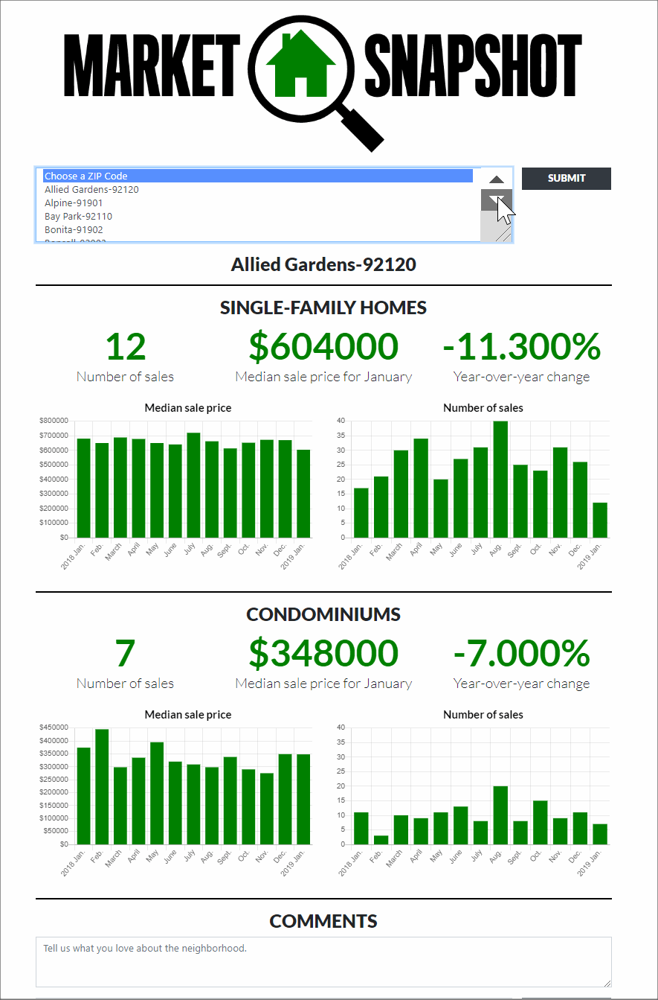
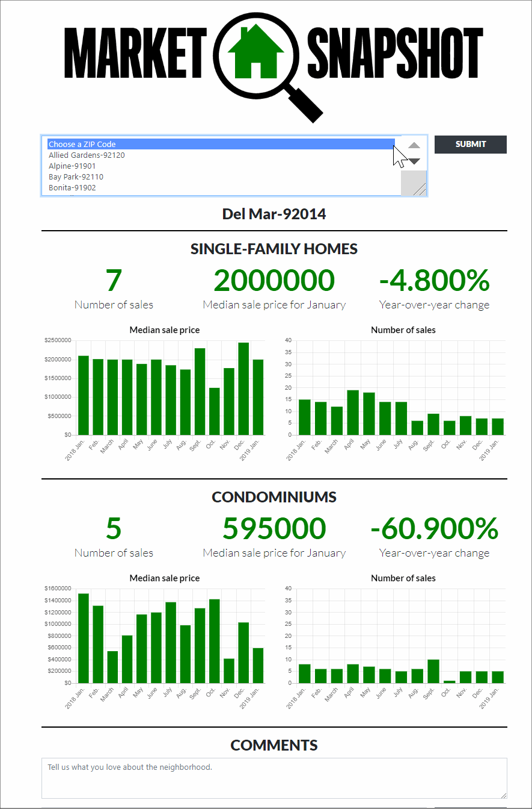

## Market Snapshot
 provides and at a glance view of the San Diego Real Estsate Market.
It  gives an idea of how the SD housing market is doing, whether you are a home owner looking to buy a home or a real estate agent.
If you are selling homes you want to know how to advise your clients. If you are looking to buy a home you can quickly see what areas you can afford and what neighborhoods to consider.

- Node + Express
- Sequelize
- Handlebars
- Mocha + Chai
- Travis CI

##How to use
https://market-snapshot.herokuapp.com/

## Heroku Deployment
https://market-snapshot.herokuapp.com/

